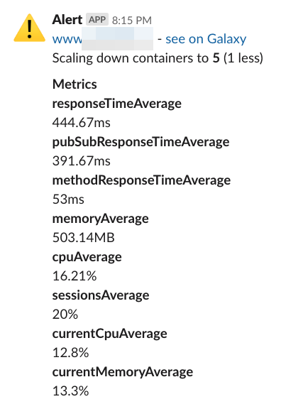
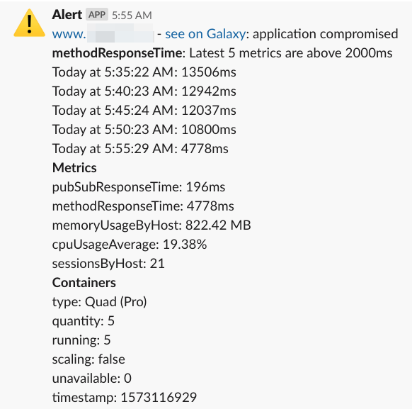
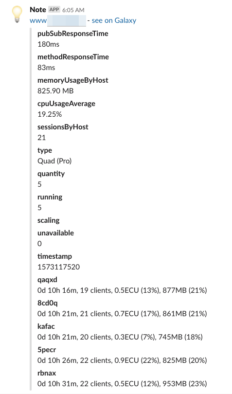

# Meteor Galaxy Auto Scaling (mgas)
NodeJS command line tool to monitor and auto-scale Meteor Galaxy

[](#contributors)

⚠️ Important: we are already using it in production for at least two months but please monitor your
 containers to be sure everything is behaving as expected and please report any issue. ⚠️

## Features
- Monitoring: reads Galaxy and Meteor APM metrics
- Alerts: reports containers and apps not running as expected
- Auto-scaling: take actions when specific conditions are met
- Send slack notifications: updates, alerts and autos-scaling messages;

## How it works
We use `puppeteer` to read Galaxy and Meteor APM dashboards and then we execute actions based on
 your
 desired settings.
 
## How to use
Set up in your CI server or equivalent a job to call `mgas` (meteor-galaxy-auto-scaling) command
 from
 time to time, it's probably a good idea to use a very short period, like every 2 minutes then
  you will be always monitoring your containers.
  
  If you need help configuring your CI check [our configurations examples](./CI.md). Please open
   an issue if you are having a hard time then we can improve the documentation. If
   you have already configured your CI please open a Pull Request including the instructions in the
    configuration examples.
  
First you need to install `mgas` (meteor-galaxy-auto-scaling) using yarn or npm: 
```
yarn global add @pathable/meteor-galaxy-auto-scaling
``` 
```
npm install -g @pathable/meteor-galaxy-auto-scaling
```

Then you run it informing a configuration file with your alerts and auto-scaling rules:
```
mgas --settings settings.json
```
You can have different settings for different purposes.


## Updates
Check the [log of changes](./CHANGELOG.md).

## Settings

```json
{
  "appName": "your app host (required)",
  "username": "your Galaxy username (required)",
  "password": "your Galaxy password (required)",
  "slackWebhook": "your Slack webhook URL",
  "silentSlack": false,
  "persistentStorage": "full path to where we want to storage scrapped info",
  "infoRules": {
    "send": true,   
    "channel": "#galaxy-updates"
  },
  "alertRules": {
    "channel": "#alerts",
    "messagePrefix": "@channel",
    "maxInContainers": {
      "cpu": 1,
      "memory": 10,
      "clients": 5
    },
    "maxInApp": {
      "pubSubResponseTime": 200,
      "methodResponseTime": 300
    }
  },
  "autoscaleRules": {
    "channel": "#auto-scaling",
    "containersToScale": 2,
    "minContainers": 2,
    "maxContainers": 10,
    "addWhen": {
      "responseTimeAbove": 300,
      "cpuAbove": 50,
      "memoryAbove":  70,
      "sessionsAbove":  50
    },
    "reduceWhen": {
      "responseTimeBelow": 150,
      "cpuBelow": 25,
      "memoryBelow": 25,
      "sessionsBelow": 30
    },
    "killWhen": {
      "responseTimeAbove": 1000,
      "cpuAbove": 90,
      "memoryAbove":  90,
      "sessionsAbove":  100
    }
  },
  "minimumStats": 5,
  "puppeteer": {
    "headless": true
  }
}

```

## Auto scale rules

The autoscaling (`autoscaleRules`) behavior is meant to adjust smartly the containers on the
 Galaxy server taking
 into account the data got from there and a predefined configuration.

- Three actions are supported:
  - `add` containers (conditions are configured on `addWhen` json key);
  - `reduce` containers (conditions are configured on `reduceWhen` json key);
  - `kill` containers (conditions are configured on `killWhen` json key).

- The conditions available are: "[responseTime|cpu|memory|sessions|currentCpu|currentMemory][Above|Below]". Check out to which values refer for each: [from Galaxy Panel](https://user-images.githubusercontent.com/2581993/68477766-26baa380-0226-11ea-81da-c0b635f717d6.png) and [APM panel](https://user-images.githubusercontent.com/2581993/68478308-764d9f00-0227-11ea-94b0-dab7dec21529.png).

- The conditions express the property average on the active containers. The active containers are
 those that are running, the ones starting or stopping are ignored.

- Multiple conditions can be informed and they are evaluated in different ways depending on the
 action
  - `add` action evaluates with `OR`, one match is enough to add new container
  - `reduce` action evaluates with `AND`, one miss match is enough to not remove one container
  - `kill` action evaluates with `AND`, one miss match is enough to not kill the container

- The `addWhen` and `reduceWhen` behaviors check to not go beyond a containers count range. This range is described by the `minContainers` and `maxContainers` configuration.

- The `addWhen` and `reduceWhen` behaviors won't run if a scaling is happening. If any other condition passes it will run on the next run.

- The `killWhen` behavior tries to kill the container with high CPU consumption and that matches the conditions configured.

- An slack message is sent anytime a scaling behavior is triggered if you set a Slack Webhook, the
 messages are sent to the default webhook channel. You will receive messages like this
 


## Alerts
You can set maximum limits for container metrics (CPU, memory and connected clients) and also for
 Meteor app metrics (response time for publications and methods).

Example:
```
"alertRules": {
    "maxInContainers": {
      "cpu": 1,
      "memory": 10,
      "clients": 5
    },
    "maxInApp": {
      "pubSubResponseTime": 200,
      "methodResponseTime": 300
    }
},
"minimumStats": 5,
```
You will receive an alert like this when at least `minimumStats` times in a row the current value
 was above the maximum expected.



  Then if you run `mgas` every 2 minutes and use `minimumStatus
  ` as 5 you will get an alert when your metric is at least 10 minutes above the maximum expected
  . 
 
 `minimumStats` is set in the first level of the settings because maybe we will use this
  information in
  the future also for auto-scaling, for now auto-scaling is not considering the `minimumStats`
   value.
 
## Info rules
- Set the channel, by default will go to default webhook channel
- You will receive messages like this



## Advanced
### Remote settings
If you need to have dynamic settings coming from a external location, like an API, you can
 configure: 
 ```json
"remote": {
    "url": "https://yourapi.com/v1/auto-scaling?yourkey=XXX&anySetting=YYY"
}
```
Then the JSON returned by this API will be merged (using `lodash.merge`) with your local settings
. If the request to this URL throws an error then the local settings will be used anyway and a
 `console.error` (`Error getting remote options from ${url}`)
 will be printed.

## Developing
If you want to include new features that includes reading new data from Galaxy or Meteor APM you
 will probably want to run `puppeteer` watching the actions, then change `headless` setting to
  `false`.
 
```
  "puppeteer": {
    "headless": false
  }
```

## Troubleshooting

### Fixing Puppeteer on Ubuntu 16.04
sudo apt-get install libx11-xcb1 libxcomposite1 libxi6 libxext6 libxtst6 libnss3 libcups2 libxss1 libxrandr2 libasound2 libpangocairo-1.0-0 libatk1.0-0 libatk-bridge2.0-0 libgtk-3-0

## Contributions
Please open issues to discuss improvements and report bugs. Also feel free to submit PRs, it is
 always a good idea to discuss first your PR idea in the issues.
 
## Contributors ✨

Thanks goes to these wonderful people ([emoji key](https://allcontributors.org/docs/en/emoji-key)):

<!-- ALL-CONTRIBUTORS-LIST:START - Do not remove or modify this section -->
<!-- prettier-ignore -->
<table>
  <tr>
    <td align="center"><a href="https://www.linkedin.com/in/filipenevola/"><br /><sub><b>Filipe Névola</b></sub></a><br /><a href="https://github.com/pathable/meteor-galaxy-auto-scaling/commits?author=filipenevola" title="Code">💻</a></td>
    <td align="center"><a href="https://es.linkedin.com/in/nachocodonergil"><br /><sub><b>Nacho Codoñer</b></sub></a><br /><a href="https://github.com/pathable/meteor-galaxy-auto-scaling/commits?author=Gywem" title="Code">💻</a></td>
  </tr>
</table>

<!-- ALL-CONTRIBUTORS-LIST:END -->

This project follows the [all-contributors](https://github.com/all-contributors/all-contributors) specification. Contributions of any kind welcome!

## LICENSE 
[MIT](LICENSE)
